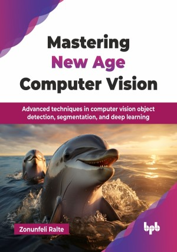

# Mastering New Age Computer Vision

Advanced techniques in computer vision object detection, segmentation, and deep learning.

This is the repository for [Mastering New Age Computer Vision
](https://bpbonline.com/products/mastering-new-age-computer-vision?variant=44463749497032),published by BPB Publications.

## About the Book
Mastering New Age Computer Vision is a comprehensive guide that explores the latest advancements in computer vision, a field that is enabling machines to not only see but also understand and interpret the visual world in increasingly sophisticated ways, guiding you from foundational concepts to practical applications.

This book explores cutting-edge computer vision techniques, starting with zero-shot and few-shot learning, DETR, and DINO for object detection. It covers advanced segmentation models like Segment Anything and Vision Transformers, along with YOLO and CLIP. Using PyTorch, readers will learn image regression, multi-task learning, multi-instance learning, and deep metric learning. Hands-on coding examples, dataset preparation, and optimization techniques help apply these methods in real-world scenarios. Each chapter tackles key challenges, introduces architectural innovations, and improves performance in object detection, segmentation, and vision-language tasks.

By the time you have turned the final page of this book, you will be a confident computer vision practitioner, armed with a comprehensive grasp of core principles and the ability to apply cutting-edge techniques to solve real-world problems. You will be prepared to develop innovative solutions across a broad spectrum of computer vision challenges, actively contributing to the ongoing advancements in this dynamic field.

## What You Will Learn
• Use PyTorch for both basic and advanced image processing.

• Build object detection models using CNNs and modern frameworks.

• Apply multi-task and multi-instance learning to complex datasets.

• Develop segmentation models, including panoptic segmentation.

• Improve feature representation with metric learning and bilinear pooling.

• Explore transformers and self-supervised learning for computer vision.
